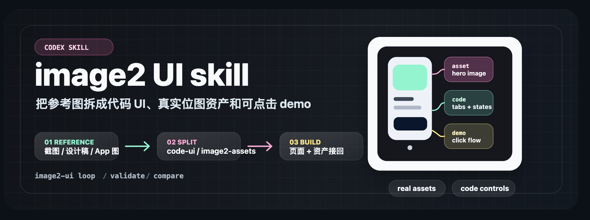
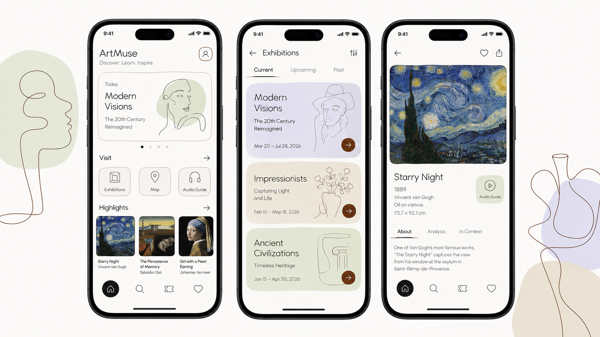
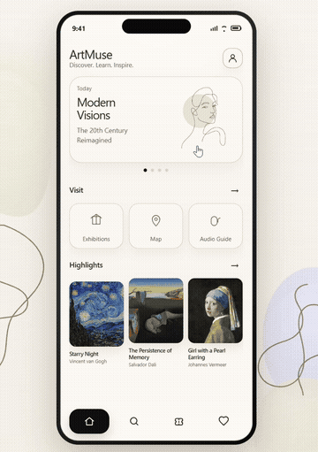
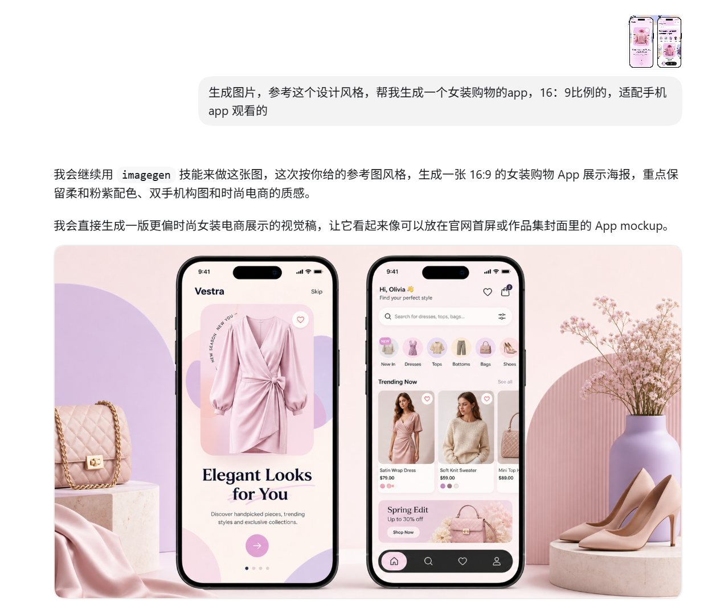
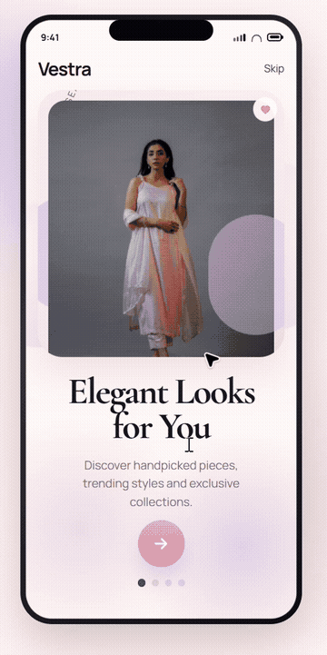
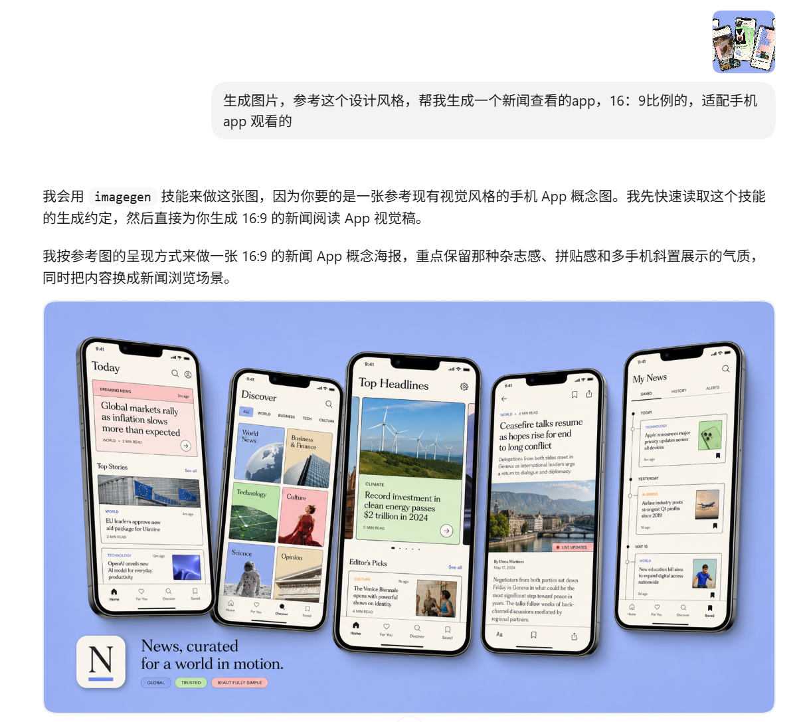
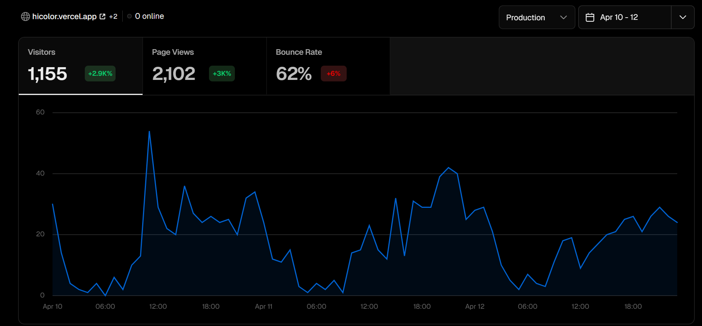
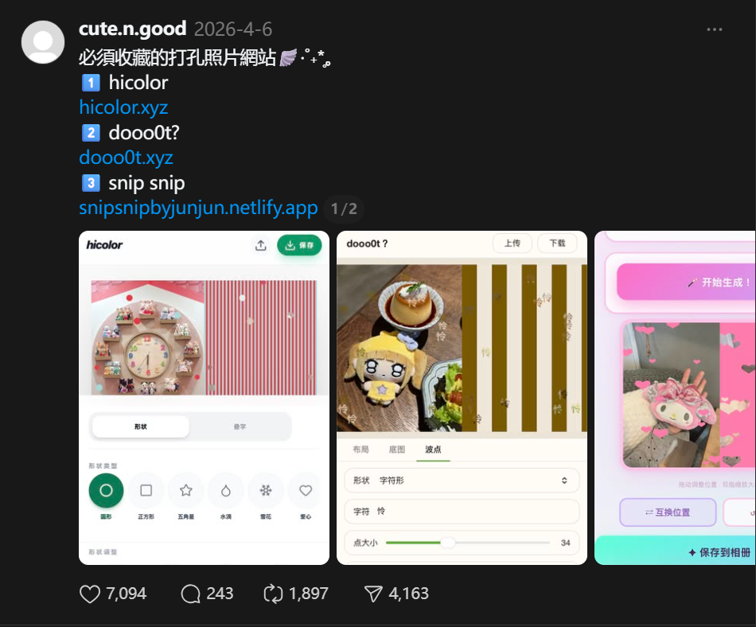

# image-to-ui-skill

> UI 截图 / 设计稿 → 1:1 还原的单文件 HTML 总览页。供 Codex / Hermes 使用。
> Turn UI screenshots, design mockups, and app references into 1:1 clickable **single-file HTML overviews** with Codex or Hermes.

<p align="center">
  
</p>

<p align="center">
  
  
  
  
</p>

把 UI 截图、设计稿、App 参考图交给 Codex 或 Hermes，技能会先拆清楚哪些用代码实现、哪些需要真实调用 `image2` 生成位图资产，再按你的参考图 **1:1 还原**，最终交付一个可打开、可点击、可继续修改的 **单文件 HTML 总览页**。

Give Codex or Hermes a UI screenshot, design mockup, or app reference. The skill splits the work into code-rendered UI and real `image2` bitmap assets, recreates the reference **1:1**, and delivers an openable, clickable, editable **single-file HTML overview**.

## 搜索关键词 / Keywords

`image to ui` · `image-to-UI` · `screenshot to code` · `design to code` · `UI 复刻` · `图转 UI` · `截图转代码` · `设计稿转 HTML` · `Codex skill` · `Hermes skill` · `单文件 HTML 总览页`

## 适合什么场景 / When To Use

- 你有 App、网页、海报式界面或产品 UI 参考图，想快速变成可点击的单文件总览页。
- You have an app, website, poster-like interface, or product UI reference and want a clickable single-file overview quickly.
- 画面里有复杂照片、商品图、插画、纹理、背景或抠图，不能只靠 CSS/SVG 占位。
- The reference includes photos, product imagery, illustration, textures, backgrounds, or cutouts that need real bitmap assets.
- 你希望最终结果能本地预览、能点击、能继续改，而不是停在"生成了一张图"。
- You want a local preview that can be clicked and iterated on, not just a single generated image.

## 安装 / Install

### Codex

macOS / Linux:

```bash
git clone https://github.com/yiiiu/image-to-ui-skill.git "${CODEX_HOME:-$HOME/.codex}/skills/image-to-ui-skill"
```

Windows PowerShell:

```powershell
git clone https://github.com/yiiiu/image-to-ui-skill.git "$env:USERPROFILE\.codex\skills\image-to-ui-skill"
```

安装后重启 Codex，或新开一个会话。

### Hermes（可选）

技能目录是 `~/.hermes/skills/`。把仓库 clone 或软链进去即可被 Hermes 加载：

```bash
git clone https://github.com/yiiiu/image-to-ui-skill.git "$HOME/.hermes/skills/image-to-ui-skill"
```

## 快速开始 / Quick Start

把参考图发给 agent，技能会**先询问你交付形态**：

```text
Q: 要单文件 HTML 总览页，还是交互式原型？
```

- **单文件 HTML 总览页（默认）**：所有屏幕的实现代码在一个 HTML 文件里，文件内结构为「总览网格（缩略图 + 名称）→ 点击切换到对应屏幕的完整视图」，用轻量 JS/锚点切换，不堆叠成长页面、不拆多文件、不启动 dev server。双击即可打开。
- **交互式原型**：多页面路由 + 完整状态与流程交互（需要你明确选择才会做）。

示例提示词：

```text
使用 image-to-ui-skill，参考我上传的图，做一个单文件 HTML 总览页。
需要真实调用 image2 生成必要图片资产，并接回页面。
```

```text
Use image-to-ui-skill with my uploaded reference image to build a single-file HTML overview.
Call image2 for the required bitmap assets and wire them back into the page.
```

## 它会怎么做 / Workflow

| 阶段 / Stage | 产出 / Output | 判断标准 / Decision rule |
| --- | --- | --- |
| 询问 / Ask | 交付形态确认 / deliverable confirmation | 默认单文件 HTML 总览页；交互式原型需用户明确选择 |
| 拆图 / Split | `code-ui` 和 `image2-assets` 两张清单 / two inventories | 文案、按钮、状态栏、导航、表单、普通 icon 进入代码；照片、产品、插画、纹理、背景进入 image2 / Text, controls, status bars, navigation, forms, and common icons are code; photos, products, illustrations, textures, and backgrounds are image2 assets. |
| 生图 / Generate | 本地图片资产与提示词记录 / local assets and prompt records | 资产有用途、尺寸、裁切方式和负面约束，不把可读 UI 文案烘焙进图片 / Assets include purpose, size, crop rules, and negative constraints; readable UI text is not baked into images. |
| 实现 / Build | 单文件 HTML 总览页或项目现有技术栈 / single-file HTML overview or existing stack | 按参考图 1:1 还原；总览网格 → 点击切换单屏；移动端不横向滚动 |
| 校验 / Verify | 截图、交互检查、图片加载检查 / screenshots and audits | 本地资源可用，关键流程可走通，输出能继续修改 |

### 生图通道规则 / Image channel rule

- 有默认生图通道（系统 imagegen / 项目指定入口 / fallback 且 API 可用）→ 直接使用。
- 没有可用通道 → **默认不使用生图**：所有视觉用代码/CSS/SVG 表达，明确标注"未生成位图"，不调用未指定的 API，不阻塞交付。

## 内置 CLI：image2-ui

技能自带巡检工具（安装到 `~/.local/bin` 后可用）：

```bash
image2-ui doctor     # 检查生图通道可用性
image2-ui validate <demo-dir> [--reference ref.png] [--no-browser]   # 静态 + 浏览器巡检
image2-ui compare --reference ref.png --actual out.png               # 参考图对照板
image2-ui loop <demo-dir> --reference ref.png                        # 迭代优化闭环
```

需要 Playwright 才能用浏览器截图模式：

```bash
cd image-to-ui-skill && npm install && npx playwright install chromium
```

## 案例 / Examples

点击参考图可以查看原图；点击预览图可以查看视频或更大的输出。

### Museum App

博物馆导览 demo，把参考图里的展览、藏品和层级关系拆成可点击的 Home、Exhibitions、Detail 流程。

<table align="center">
  <tr>
    <th align="center">参考图 / Reference</th>
    <th align="center">可点击 demo 预览 / Clickable demo preview</th>
  </tr>
  <tr>
    <td align="center">
      <a href="./assets/cases/museum-app/reference-overview.png"></a>
    </td>
    <td align="center">
      <a href="./assets/cases/museum-app/museum-app-demo.mp4"></a>
      <br>
      <a href="./assets/cases/museum-app/museum-app-demo.mp4">查看视频 / Watch video</a>
    </td>
  </tr>
</table>

### Fashion Shopping App

时尚购物 App 原型，把商品视觉留给图片资产，把 tab、筛选、收藏、卡片状态交给代码实现。

<table align="center">
  <tr>
    <th align="center">参考图 / Reference</th>
    <th align="center">可点击 demo 预览 / Clickable demo preview</th>
  </tr>
  <tr>
    <td align="center">
      <a href="./assets/cases/fashion-shopping-app/reference-overview.png"></a>
    </td>
    <td align="center">
      <a href="./assets/cases/fashion-shopping-app/fashion-app-demo.mp4"></a>
      <br>
      <a href="./assets/cases/fashion-shopping-app/fashion-app-demo.mp4">查看视频 / Watch video</a>
    </td>
  </tr>
</table>

### News App

新闻阅读与发现页 demo，用代码处理列表、标签、底部导航和状态切换，用资产承载新闻封面与视觉氛围。

<table align="center">
  <tr>
    <th align="center">参考图 / Reference</th>
    <th align="center">可点击 demo 预览 / Clickable demo preview</th>
  </tr>
  <tr>
    <td align="center">
      <a href="./assets/cases/news-app/reference-overview.png"></a>
    </td>
    <td align="center">
      <a href="./assets/cases/news-app/news-app-demo.mp4"></a>
      <br>
      <a href="./assets/cases/news-app/news-app-demo.mp4">查看视频 / Watch video</a>
    </td>
  </tr>
</table>

### hicolor

内容增长与图文案例展示，适合检验"参考素材 + 结构化页面 + 真实图文资产"的组合输出。

<table align="center">
  <tr>
    <th align="center">素材 / Material</th>
    <th align="center">输出 / Output</th>
  </tr>
  <tr>
    <td align="center">
      <a href="./assets/cases/hicolor/traffic-3-days.png"></a>
    </td>
    <td align="center">
      <a href="./assets/cases/hicolor/threads-recommendation.png"></a>
      <br>
      <a href="./assets/cases/hicolor/xiaohongshu-pinned.jpg">查看补充图 / View extra image</a>
    </td>
  </tr>
</table>

## 关键约束 / Key Rules

- 需要生图时必须调用项目指定的 `image2`。如果当前环境没有可用入口，说明缺口，不把 CSS/SVG/占位图说成已生图；没有通道时默认不使用生图。
- 生成图片里不要包含可读 UI 文案、logo、水印、状态栏、按钮或小图标。
- 返回、关闭、菜单、搜索、设置、电量、Wi-Fi、播放、底部 tab、开关、加减号都应该由代码渲染（统一图标系统，不混用多套图标库）。
- 以用户参考图为准做 1:1 还原（布局、间距、字号、颜色、图标、比例、留白），不确定的细节先按参考图原样做，不自由发挥。
- 最终交付物必须可打开、可点击、可继续修改。

## 仓库结构 / Repository Structure

```text
.
|-- SKILL.md                  # 技能入口与执行规则 / skill entry and execution rules
|-- references/               # 拆图、图标系统、工程闭环、案例参考 / splitting, icons, loop, cases
|-- scripts/                  # image2-ui CLI（doctor / validate / compare / loop）
|-- assets/                   # README 与案例媒体 / README and case media
|-- package.json              # image2-ui CLI 的 bin 声明与依赖
`-- agents/                   # 多 agent 编排定义 / multi-agent orchestration
```

## Multi-Agent Production Flow

When the host supports subagents, the skill can orchestrate these specialist roles:

```text
Visual + Asset
      |
Architecture + Backend Contract + State Machine
      |
UI Implementation
      |
Accessibility + QA
      |
Release
```

If subagent tools are unavailable, the same roles run sequentially in one agent. See `references/multi-agent-orchestration.md` for inputs, outputs, handoff artifacts, and reusable prompts.

## 来源 / Origin

本仓库 fork 自 [zhu-guli326/image2_UI_skill](https://github.com/zhu-guli326/image2_UI_skill)，在此之上修复了 SKILL.md 编码、补齐 CLI 与依赖、并调整了默认交付规则（单文件 HTML 总览页 + 1:1 还原）。原仓库未附带 LICENSE 文件，如有版权问题请联系原作者。
